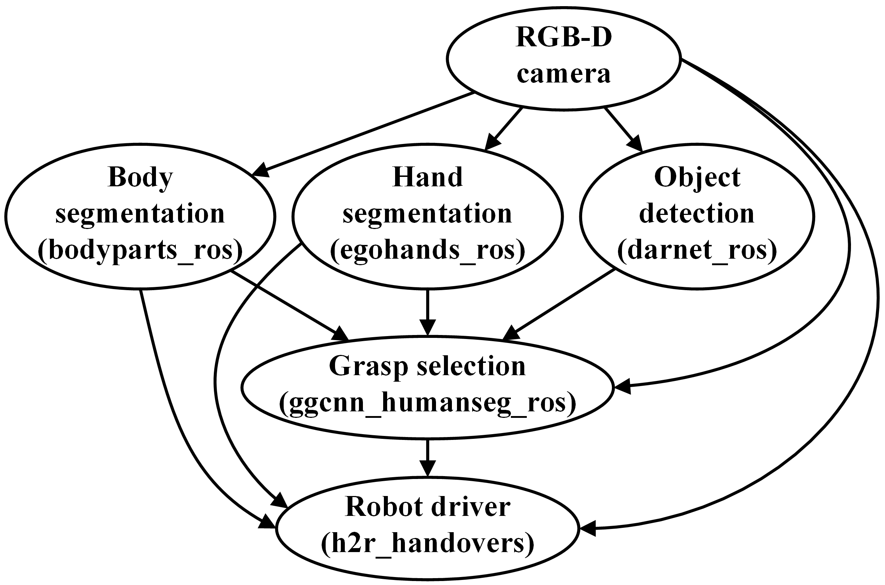
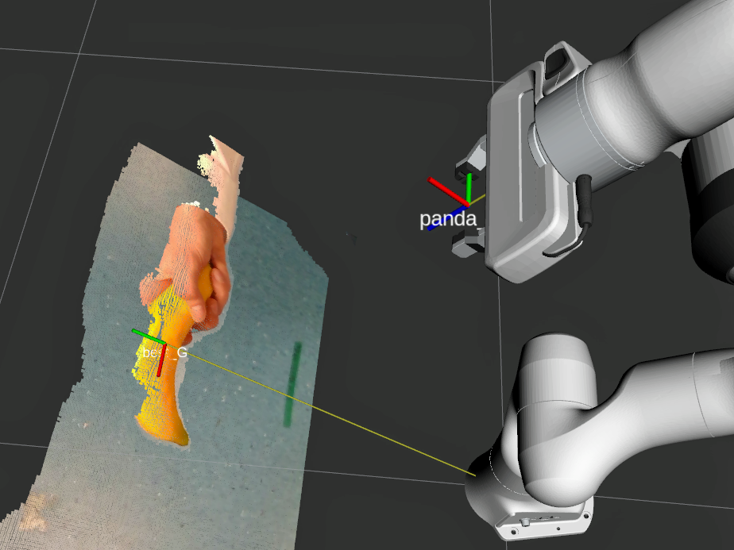

This project introduces an approach for safe and object-independent human-to-robot handovers using real time robotic vision and manipulation.

**Authors:** Patrick Rosenberger, Akansel Cosgun, Rhys Newbury, Jun Kwan, Valerio Ortenzi, Peter Corke and Manfred Grafinger

**Publication:** *cooming soon*

**Preprint:** *coming soon*

**Code:** [https://github.com/patrosAT/h2r_handovers](https://github.com/patrosAT/h2r_handovers)

---

## Approach ##

We aim for general applicability by combining the power of a generic object detector *(darknet_ros)*, a real-time grasp selection algorithm *(ggcnn_humanseg_ros)* and two semantic segmentation modules for body segmentation *(bodyparts_ros)* and hand segmentation *(egohands_ros)*. 

The RGB-D camera is mounted at the robot's end effector and provides a steady stram of RGB and depth images that that are used by all modules. For each frame, the object detecter detects all objects within the camera's field of view and selects the ones within the robot's reach. Further, all pixels belonging to the human interaction partner and the partner's hands are segmented. The grasp selection module uses these inputs to calculate the a grasp quality estimation along with the associated grasp orientation and gripper width for each pixel in the depth image. Finally, the grasp point with the highest estimated success likelihood is chosen and translated into the robot's base frame. The robot driver module moves the end effector towards the selected grasp point via visual servoing. The segmentation masks are updated in real-time to dynamically handle the changes in the hand/body positions.

### Software ###
The code developed within this project is written in Python 2.7 and 3.6, depending on the module. Please refer to the individual repositories for more information:

* [realsense](https://github.com/IntelRealSense/realsense-ros) *(external)*
* [bodyparts_ros](https://github.com/patrosAT/bodyparts_ros.git)
* [egohands_ros](https://github.com/patrosAT/egohands_ros.git)
* [rarknet_ros](https://github.com/leggedrobotics/darknet_ros) *(external)*
* [ggcnn_humanseg_ros](https://github.com/patrosAT/ggcnn_humanseg_ros.git)
* [h2r_handovers](https://github.com/patrosAT/h2r_handovers)

 
### Hardware ###

* Robot *(this project used a [Franka-Emika Panda](https://www.franka.de/)).*
* Depth camera *(this project used a [Realsense D435](https://www.intelrealsense.com/depth-camera-d435/)).*
 

## Examples ##

### Example Video ###
[This youtube video](https://youtu.be/GjPDilJO4F0) shows the handover of 20 household objects from a frontal and a lateral perspective.

### Example RVIZ ###
This image shows the handover of a banana as seen by the robot. The visualization was done in RVIZ.

## Acknowledgments ##

**Special thanks go to [TU Wien](www.tuwien.at) and the [Australian Center for Robotic Vision (ACRV)](http://roboticvision.org) for enabling this research project.**

## License ##

The project is licensed under the BSD 4-Clause License.

## Disclaimer ##

Please keep in mind that no system is 100% fault tolerant and that this demonstrator is focused on pushing the boundaries of innovation. Careless interaction with robots can lead to serious injuries, always use appropriate caution!

This software is provided by the copyright holders and contributors "as is" and any express or implied warranties, including, but not limited to, the implied warranties of merchantability and fitness for a particular purpose are disclaimed. in no event shall the copyright holder or contributors be liable for any direct, indirect, incidental, special, exemplary, or consequential damages (including, but not limited to, procurement of substitute goods or services; loss of use, data, or profits; or business interruption) however caused and on any theory of liability, whether in contract, strict liability, or tort (including negligence or otherwise) arising in any way out of the use of this software, even if advised of the possibility of such damage.
