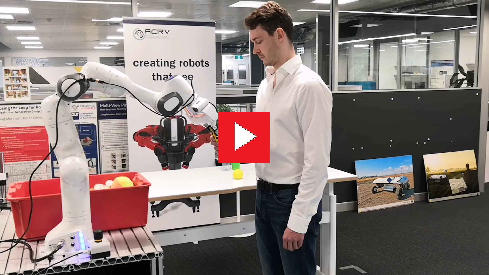
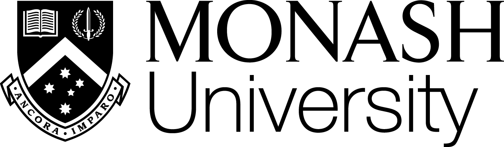

**Authors:** Patrick Rosenberger [[TU Wien]](https://www.mivp.tuwien.ac.at/team/patrick_rosenberger/EN/) [[orcid]](https://orcid.org/0000-0002-5504-0267) [[homepage]](https://www.roscon.at/team/), Akansel Cosgun [[Uni Monash]](https://research.monash.edu/en/persons/akansel-cosgun), Rhys Newbury, Jun Kwan, Valerio Ortenzi [[Uni Brimingham]](https://www.birmingham.ac.uk/staff/profiles/metallurgy/ortenzi-valerio.aspx) [[orcid]](https://orcid.org/0000-0002-8194-1616), Peter Corke [[QUT]](https://staff.qut.edu.au/staff/peter.corke) [[orcid]](https://orcid.org/0000-0001-6650-367X) [[homepage]](https://petercorke.com/), Manfred Grafinger [[TU Wien]](https://www.mivp.tuwien.ac.at/team/manfred_grafinger/EN/) [[orcid]](https://orcid.org/0000-0001-6596-1126)

**Publication:** IEEE Robotics and Automation Letters

**Preprint:** https://arxiv.org/abs/2006.01797

**Code:** [https://github.com/patrosAT/h2r_handovers](https://github.com/patrosAT/h2r_handovers)

[The youtube video](https://youtu.be/SkTx4GLpw9E) shows the handover of 20 household objects from a frontal and a lateral perspective.

A detailed demonstration (incl. failed handovers) of the approach can be found in [this long version](https://youtu.be/u53mgDZI_so).

---

## Approach ##
This project introduces an approach for safe and object-independent human-to-robot handovers using real time robotic vision and manipulation. We aim for general applicability by combining the power of a generic object detector *(darknet_ros)*, a real-time grasp selection algorithm *(ggcnn_humanseg_ros)* and two semantic segmentation modules for body segmentation *(bodyparts_ros)* and hand segmentation *(egohands_ros)*.

The appraoch uses a RGB-D camera that is mounted at the robot's end effector and provides a steady stream of RGB and depth images. For each frame, the object detector detects all objects within the camera's field of view and selects the ones within the robot's reach. Further, all pixels belonging to the human interaction partner and the partner's hands are segmented. The grasp selection module uses these inputs to calculate the a grasp quality estimation along with the associated grasp orientation and gripper width for each pixel in the depth image. Finally, the grasp point with the highest estimated success likelihood is chosen and translated into the robot's base frame. The robot driver module moves the end effector towards the selected grasp point via visual servoing. The segmentation masks are updated in real-time to dynamically handle the changes in the hand/body positions.

### Module bodyparts_ros ###

This module implements a light-weight [RefineNet NN](https://github.com/DrSleep/light-weight-refinenet) trained on the PASCAL body parts data set. The NN is capable of detecting human body parts and can differentiate between heads, torsos, upper arms, lower arms, upper legs, and lower legs with a mean intersection-over-union (mIoU) score of 0.649 ([Nek18](https://github.com/DrSleep/light-weight-refinenet)).

### Module egohands_ros ###

This module implements a [Scene Parsing framework (PSPNet)](https://github.com/CSAILVision/semantic-segmentation-pytorch) retrained on the egohands data set. The trained model achieved a mIoU of 0.897 and a pixel accuracy of 0.986 on the validation set.

### Module darknet_ros ###

This module implements a [YOLO v3 object detector](https://github.com/leggedrobotics/darknet_ros), trained on the COCO dataset. Since our goal is to enable handovers for any class of objects, we allow misclassifications for objects that do not belong to one of the 80 categories of the dataset.

### Module ggcnn_humanseg_ros ###

This module implements a [GGCNN](https://github.com/dougsm/ggcnn). The node outputs the best picking location based on an object's depth image and the input of the three packages [bodyparts_ros](https://github.com/patrosAT/bodyparts_ros), [egohands_ros](https://github.com/patrosAT/egohands_ros) and [rarknet_ros](https://github.com/leggedrobotics/darknet_ros). Extensive pre- and post-processing prevents the picking of human body parts.

### Module h2r_handovers ###

This module provides a driver for object-independent human-to-robot handovers using robotic vision. The approach requires only one RGBD camera and can therefore be used in a variety of use cases without the need for artificial setups like markers or external cameras.

### Software ###
The code developed within this project is written in Python 2.7 and 3.6, depending on the module. Please refer to the individual repositories for more information:

* [realsense](https://github.com/IntelRealSense/realsense-ros) *(external)*
* [bodyparts_ros](https://github.com/patrosAT/bodyparts_ros.git)
* [egohands_ros](https://github.com/patrosAT/egohands_ros.git)
* [darknet_ros](https://github.com/leggedrobotics/darknet_ros) *(external)*
* [ggcnn_humanseg_ros](https://github.com/patrosAT/ggcnn_humanseg_ros.git)
* [h2r_handovers](https://github.com/patrosAT/h2r_handovers)

 
### Hardware ###

* Robot *(this project used a [Franka-Emika Panda](https://www.franka.de/)).*
* Depth camera *(this project used a [Realsense D435](https://www.intelrealsense.com/depth-camera-d435/)).*
 

## Acknowledgments ##

**Special thanks go to [TU Wien](https://www.tuwien.at) and the [Australian Center for Robotic Vision (ACRV)](http://roboticvision.org) for enabling this research project.**

## License ##

The project is licensed under the BSD 4-Clause License.

## Disclaimer ##

Please keep in mind that no system is 100% fault tolerant and that this demonstrator is focused on pushing the boundaries of innovation. Careless interaction with robots can lead to serious injuries, always use appropriate caution!

This software is provided by the copyright holders and contributors "as is" and any express or implied warranties, including, but not limited to, the implied warranties of merchantability and fitness for a particular purpose are disclaimed. in no event shall the copyright holder or contributors be liable for any direct, indirect, incidental, special, exemplary, or consequential damages (including, but not limited to, procurement of substitute goods or services; loss of use, data, or profits; or business interruption) however caused and on any theory of liability, whether in contract, strict liability, or tort (including negligence or otherwise) arising in any way out of the use of this software, even if advised of the possibility of such damage.
